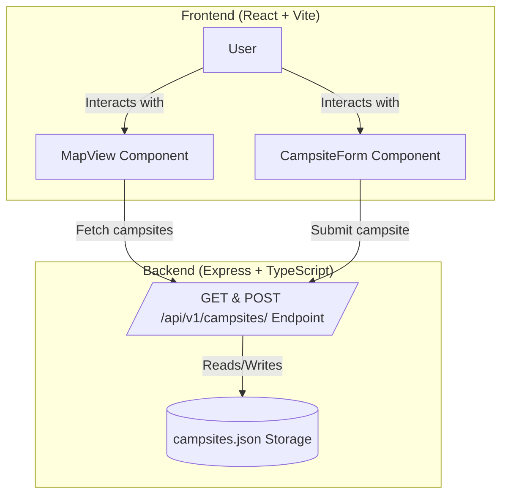

# Campsights

Campsights is a full-stack web app for discovering and sharing campsites. Users can view campsites on a map, add new ones with ratings and details, and see which require 4WD access.

## Features

- View campsites on an interactive map
- Add new campsites with name, description, rating, coordinates, and 4WD requirement
- Data is stored in a JSON file on the backend

## Project Structure

```
campsights/
  client/   # React + Vite frontend
    src/
      components/      # React components (MapView, CampsiteForm)
      types/           # TypeScript interfaces
      App.tsx          # Main app component
      main.tsx         # Entry point
    public/
    App.css            # Global styles
    ...
  server/   # Express + TypeScript backend
    src/
      index.ts         # Main server file
      types/           # TypeScript interfaces
    data/
      campsites.json   # Campsite data
    ...
```



## Getting Started

### 1. Install dependencies

From the root directory:

```sh
cd server
npm install
cd ../client
npm install
```

### 2. Run the app

Start the backend:

```sh
cd ../server
npm start
```

Start the frontend:

```sh
cd ../client
npm run dev
```

Frontend: [http://localhost:5173](http://localhost:5173)  
Backend API: [http://localhost:3000/api/v1/campsites](http://localhost:3000/api/v1/campsites)

## API

- `GET /api/v1/campsites` — List all campsites
- `POST /api/v1/campsites` — Add a new campsite