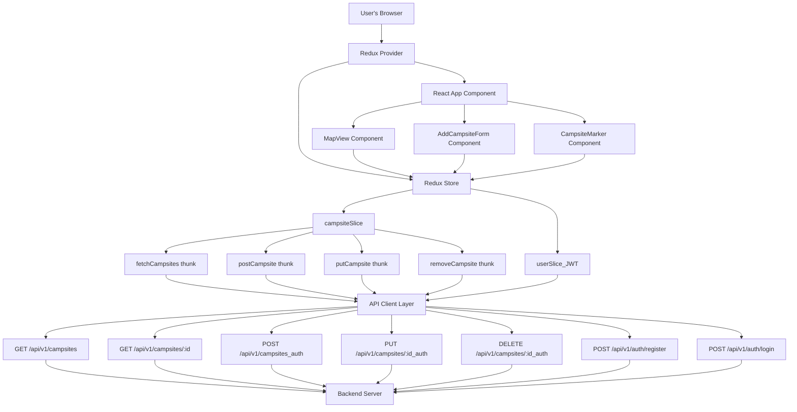
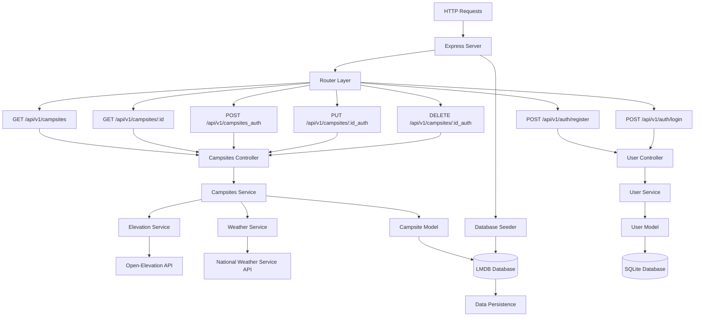

# Campsights

Campsights is a full-stack web app for discovering and sharing campsites. Users can view campsites on a map, see weather forecasts, get directions, add new ones with details, and see which require 4WD access.

**Live project link:** https://campsights.onrender.com/

**API documentation:** [Swagger UI (OpenAPI docs)](https://campsights.onrender.com/docs) — Interactive API explorer and schema

## Tech Stack

- **Frontend:** React, Vite, TypeScript, Redux Toolkit, React-Leaflet, Vitest, CSS Modules
- **Backend:** Express, TypeScript, LMDB (for fast key-value storage), National Weather Service API integration, Open Elevation API integration
- **Monorepo:** Managed with [Lerna](https://lerna.js.org/)
- **Testing:** Vitest (client & server)
- **Containerization:** Docker, Docker Compose

## Features

- View campsites on an interactive Leaflet map
- See multi-day weather forecasts and elevation data for each campsite
- Get directions to any campsite via Google Maps
- Add new campsites with name, description, coordinates, and 4WD requirement (requires login)
- Edit and delete campsites (requires login)
- Auth-aware UI: edit/delete buttons only visible when logged in
- Data is stored in LMDB (campsites) and SQLite (users) and served via REST API
- JWT authentication for all protected endpoints (register/login, token-based access)
- Comprehensive unit and integration tests using Vitest
- Installable as a **Progressive Web App (PWA)** for offline use:
  - Add to your home screen or desktop for a native app experience
  - Works offline: previously loaded data and the app shell are available without a network connection
  - Offline status indicator with clear messaging
  - Caches static assets and API responses for fast repeat visits

## Monorepo & Lerna

This project uses a **monorepo** structure managed by [Lerna](https://lerna.js.org/).  
Lerna helps manage multiple packages (the frontend and backend) in a single repository. Install all the dependencies for both packages by running `npm i` at root.

**Packages:**
- `packages/client` — The React frontend
- `packages/server` — The Express backend

### Client



### Server



## Running with Docker

Docker in this app is used to package both the frontend (React) and backend (Express) into a single container.

### Build and start the app

From the project root, run:

```sh
docker-compose up --build
```

- The app will be available at [http://localhost:4000](http://localhost:4000)
- Both the frontend (React) and backend API are served from this address.

### Stopping the app

Press `Ctrl+C` in the terminal running Docker Compose, or run:

```sh
docker-compose down
```

## Local Development (without Docker)

You can still run the client and server separately for development:

```sh
# In one terminal
cd server
npm install
npm run dev

# In another terminal
cd client
npm install
npm run dev
```

- Frontend: [http://localhost:5173](http://localhost:5173)
- Backend API: [http://localhost:3000/api/v1/campsites](http://localhost:3000/api/v1/campsites)

## API

### `GET /api/v1/campsites`
- **Description:** Returns a list of all campsites.
- **Response:**
  - Status: `200 OK`
  - Body: Array of campsite objects with elevation data attached
    ```json
    [
      {
        "id": "string",
        "name": "string",
        "description": "string",
        "lat": number,
        "lng": number,
        "requires_4wd": boolean,
        "last_updated": "ISO8601 string",
        "elevation": number,
      },
      ...
    ]
    ```

### `GET /api/v1/campsites/:id`
- **Description:** Returns a campsite object by id.
- **Response:**
  - Status: `200 OK`
  - Body: Campsite object with weather and elevation data attached
```json
    {
      "id": "string",
      "name": "string",
      "description": "string",
      "lat": number,
      "lng": number,
      "requires_4wd": boolean,
      "last_updated": "ISO8601 string",
      "elevation": number,
      "weather": [
        {
              "number": number,
              "name": "string",
              "startTime": "string",
              "endTime": "string",
              "isDaytime": boolean,
              "temperature": number,
              "temperatureUnit": "string",
              "temperatureTrend": "string",
              "probabilityOfPrecipitation": {
                  "unitCode": "string",
                  "value": number
              },
              "windSpeed": "string",
              "windDirection": "string",
              "icon": "string",
              "shortForecast": "string",
              "detailedForecast": "string"
          },
          ...
      ] 
    }
```

### `POST /api/v1/campsites`
- **Description:** Add a new campsite.
- **Request Body:**
  - JSON object with the following fields:
    ```json
    {
      "id": "string", 
      "name": "string",
      "description": "string",
      "lat": number,
      "lng": number,
      "requires_4wd": boolean,
      "last_updated": "ISO8601 string"
    }
    ```
- **Response:**
  - Status: `201 Created`
  - Body: The created campsite object

### `PUT /api/v1/campsites/:id`
- **Description:** Update an existing campsite by ID.
- **Request Body:**
  - JSON object with the following fields (same as POST, except `id` is in the URL):
    ```json
    {
      "name": "string",
      "description": "string",
      "lat": number,
      "lng": number,
      "requires_4wd": boolean,
      "last_updated": "ISO8601 string"
    }
    ```
- **Response:**
  - Status: `200 OK`
  - Body: The updated campsite object

###  `DELETE /api/v1/campsites/:id`
- **Description:** Delete an existing campsite by ID.
- **Response:**
  - Status: `204 No Content`
  - Body: N/A

## Authentication & User Accounts

Campsights uses **JWT-based authentication** for all protected API endpoints. User accounts are stored securely in a persistent SQLite database on the backend.

**How it works:**
- Register a user: `POST /api/v1/auth/register` with `{ "username": "yourusername", "password": "yourpassword" }`
- Log in: `POST /api/v1/auth/login` with the same body. Both return `{ token: "<JWT>" }`.
- For any protected route (add, edit, delete campsites), include the JWT in the `Authorization` header:

```http
Authorization: Bearer <your-jwt-token>
```

If the token is missing or invalid, the API will return a 401 Unauthorized error.

**Frontend:**
- The Redux store tracks the current user's JWT and username.
- The UI only shows edit/delete buttons for campsites if the user is logged in.
- All requests to protected endpoints automatically include the JWT if present.

**Backend:**
- User registration and login endpoints (`/auth/register`, `/auth/login`) are implemented with secure password hashing (bcrypt) and JWT issuance.
- All protected routes (add, edit, delete campsites) require a valid JWT.
- User data is stored in SQLite (`data/users.sqlite3`), and campsite data is stored in LMDB.
- The backend auto-creates the SQLite directory if missing.

**OpenAPI & Docs:**
- The OpenAPI spec documents all authentication flows, request/response schemas, and security schemes for JWT.
- Example curl commands and usage are provided in the backend README.

**Testing:**
- Both backend and frontend have updated tests for authentication, user registration, login, and auth-aware UI logic.

## Elevation Data

Campsights uses the [Open-Elevation API](https://github.com/Jorl17/open-elevation/blob/master/docs/api.md) to fetch elevation data for each campsite based on its latitude and longitude.

- **How it works:**
  - When a campsite is created or its coordinates are updated, the backend fetches the elevation from the Open-Elevation API.
  - The elevation (in meters) is stored with the campsite record in the database and included in all API responses.
  - The backend only fetches elevation once per campsite (on creation or coordinate change); all reads use the stored value.
  - If the Open-Elevation API is unavailable or returns an error, the elevation is set to `null` and displayed as "Unknown" in the UI.

## Weather Data

Campsights uses the [National Weather Service (NWS) API](https://www.weather.gov/documentation/services-web-api) to provide detailed weather forecasts for each campsite location.

- **How it works:**
  - When a campsite is requested, the backend fetches the weather forecast from the NWS API using the campsite's latitude and longitude.
  - The backend queries the NWS `/points/{lat},{lng}` endpoint to get the appropriate forecast URL for the location, then fetches the multi-day forecast.
  - The weather data is included in the API response for each campsite.
  - The frontend displays the weather data provided by the backend.
  - If the NWS API is unavailable or returns an error, a user-friendly error message is shown and weather data is omitted for that campsite.

- **NWS API Reference:**
  - [API Documentation](https://www.weather.gov/documentation/services-web-api)
  - Example forecast request:
    `GET https://api.weather.gov/points/39.7392,-104.9903`
  - Example forecast response (truncated):
    ```json
    {
      "properties": {
        "forecast": "https://api.weather.gov/gridpoints/BOU/62,61/forecast"
      }
    }
    ```
    Then:
    `GET https://api.weather.gov/gridpoints/BOU/62,61/forecast`
    ```json
    {
      "properties": {
        "periods": [
          {
            "name": "Today",
            "startTime": "2025-06-29T06:00:00-06:00",
            "temperature": 75,
            "temperatureUnit": "F",
            "windSpeed": "10 mph",
            "windDirection": "NW",
            "shortForecast": "Sunny",
            "detailedForecast": "Sunny, with a high near 75. Northwest wind 10 mph."
          },
          // ...more periods...
        ]
      }
    }
    ```