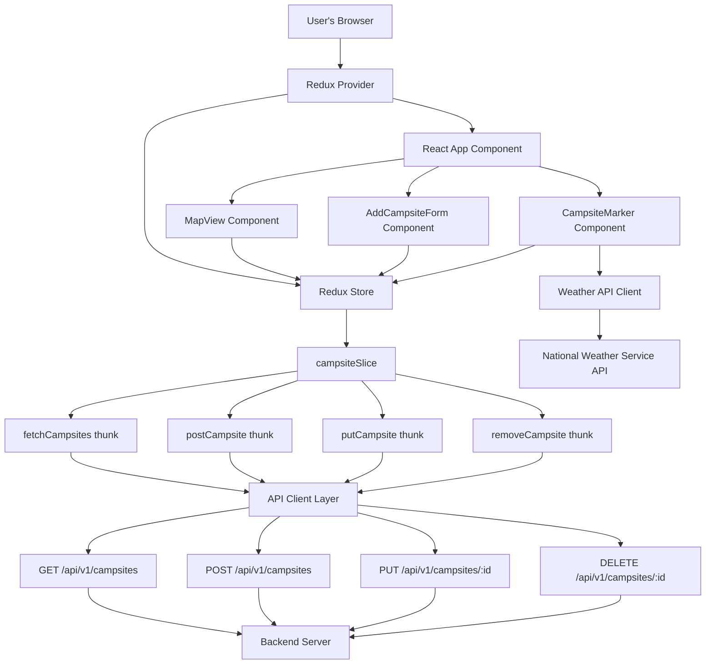
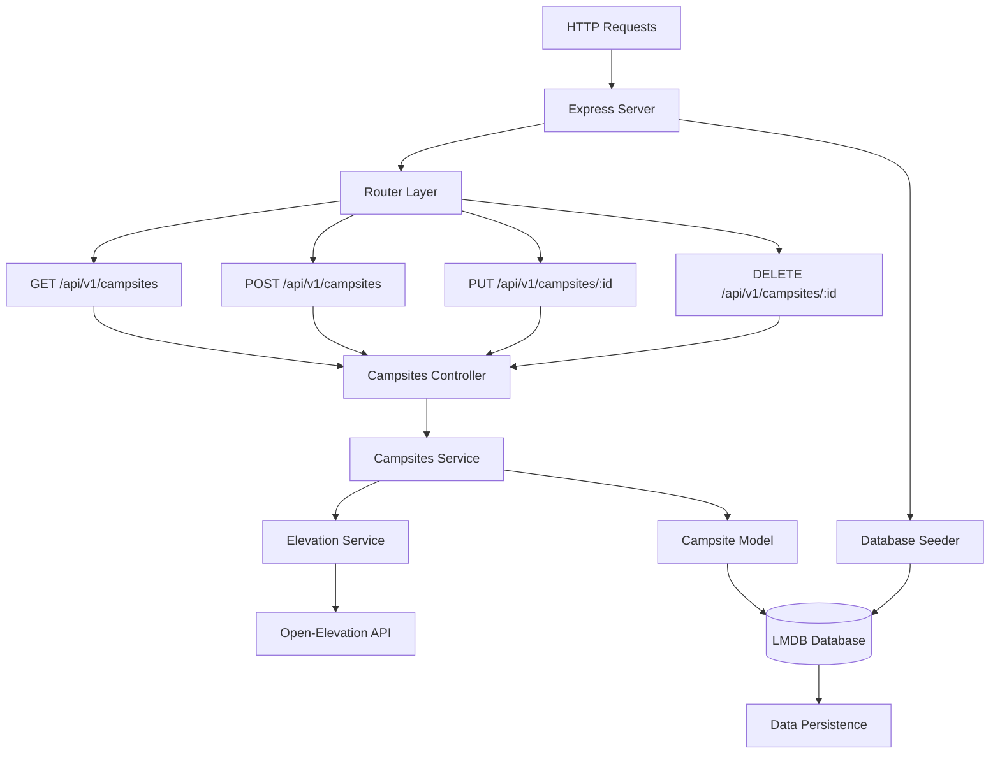

# Campsights

Campsights is a full-stack web app for discovering and sharing campsites. Users can view campsites on a map, see weather forecasts, get directions, add new ones with details, and see which require 4WD access.

**Live project link:** https://campsights.onrender.com/

## Tech Stack

- **Frontend:** React, Vite, TypeScript, Redux Toolkit, React-Leaflet, Vitest, CSS Modules
- **Backend:** Express, TypeScript, LMDB (for fast key-value storage), National Weather Service API integration
- **Monorepo:** Managed with [Lerna](https://lerna.js.org/)
- **Testing:** Vitest (client & server)
- **Containerization:** Docker, Docker Compose

## Features

- View campsites on an interactive Leaflet map
- See multi-day weather forecasts for each campsite
- Get directions to any campsite via Google Maps
- Add new campsites with name, description, coordinates, and 4WD requirement
- Edit and delete campsites
- Data is stored in LMDB (server) and served via REST API
- All weather and directions UI is styled via CSS for maintainability
- Comprehensive unit and integration tests using Vitest

## Monorepo & Lerna

This project uses a **monorepo** structure managed by [Lerna](https://lerna.js.org/).  
Lerna helps manage multiple packages (the frontend and backend) in a single repository. Install all the dependencies for both packages by running `npm i` at root.

**Packages:**
- `packages/client` — The React frontend
- `packages/server` — The Express backend

### Client



### Server



## Running with Docker

Docker in this app is used to package both the frontend (React) and backend (Express) into a single container.

### Build and start the app

From the project root, run:

```sh
docker-compose up --build
```

- The app will be available at [http://localhost:3000](http://localhost:3000)
- Both the frontend (React) and backend API are served from this address.

### Stopping the app

Press `Ctrl+C` in the terminal running Docker Compose, or run:

```sh
docker-compose down
```

## Local Development (without Docker)

You can still run the client and server separately for development:

```sh
# In one terminal
cd server
npm install
npm run dev

# In another terminal
cd client
npm install
npm run dev
```

- Frontend: [http://localhost:5173](http://localhost:5173)
- Backend API: [http://localhost:3000/api/v1/campsites](http://localhost:3000/api/v1/campsites)

## API

### `GET /api/v1/campsites`
- **Description:** Returns a list of all campsites.
- **Response:**
  - Status: `200 OK`
  - Body: Array of campsite objects
    ```json
    [
      {
        "id": "string",
        "name": "string",
        "description": "string",
        "lat": number,
        "lng": number,
        "elevation": number,
        "requires_4wd": boolean,
        "last_updated": "ISO8601 string"
      },
      ...
    ]
    ```

### `POST /api/v1/campsites`
- **Description:** Add a new campsite.
- **Request Body:**
  - JSON object with the following fields:
    ```json
    {
      "id": "string", // required, unique
      "name": "string",
      "description": "string",
      "lat": number,
      "lng": number,
      "requires_4wd": boolean,
      "last_updated": "ISO8601 string"
    }
    ```
- **Response:**
  - Status: `201 Created`
  - Body: The created campsite object

### `PUT /api/v1/campsites/:id`
- **Description:** Update an existing campsite by ID.
- **Request Body:**
  - JSON object with the following fields (same as POST, except `id` is in the URL):
    ```json
    {
      "name": "string",
      "description": "string",
      "lat": number,
      "lng": number,
      "requires_4wd": boolean,
      "last_updated": "ISO8601 string"
    }
    ```
- **Response:**
  - Status: `200 OK`
  - Body: The updated campsite object

###  `DELETE /api/v1/campsites/:id`
- **Description:** Delete an existing campsite by ID.
- **Response:**
  - Status: `204 No Content`
  - Body: N/A

## Elevation Data

Campsights uses the [Open-Elevation API](https://github.com/Jorl17/open-elevation/blob/master/docs/api.md) to fetch elevation data for each campsite based on its latitude and longitude.

- **How it works:**
  - When a campsite is created or updated, the backend queries the Open-Elevation API to retrieve the elevation for the provided coordinates.
  - Elevation is fetched using the POST endpoint (`/api/v1/lookup`), which allows batch requests for multiple locations at once. This improves efficiency and reduces redundant API calls.
  - The elevation (in meters) is then stored with the campsite record and included in all API responses.
  - The frontend displays the elevation in both meters and feet.
  - If the Open-Elevation API is unavailable or returns an error, the elevation is set to `null` and displayed as "Unknown" in the UI.

## Weather Data

Campsights uses the [National Weather Service (NWS) API](https://www.weather.gov/documentation/services-web-api) to provide detailed weather forecasts for each campsite location.

- **How it works:**
  - When viewing a campsite, the frontend requests a weather forecast using the campsite's latitude and longitude.
  - The client queries the NWS `/points/{lat},{lng}` endpoint to get the appropriate forecast URL for the location.
  - It then fetches the multi-day forecast from the returned URL, which includes temperature, wind, and summary information for each period (day or night).
  - The weather data is displayed in the UI for each campsite, including temperature, forecast summary, and wind details.
  - If the NWS API is unavailable or returns an error, a user-friendly error message is shown and weather data is omitted for that campsite.

- **NWS API Reference:**
  - [API Documentation](https://www.weather.gov/documentation/services-web-api)
  - Example forecast request:
    `GET https://api.weather.gov/points/39.7392,-104.9903`
  - Example forecast response (truncated):
    ```json
    {
      "properties": {
        "forecast": "https://api.weather.gov/gridpoints/BOU/62,61/forecast"
      }
    }
    ```
    Then:
    `GET https://api.weather.gov/gridpoints/BOU/62,61/forecast`
    ```json
    {
      "properties": {
        "periods": [
          {
            "name": "Today",
            "startTime": "2025-06-29T06:00:00-06:00",
            "temperature": 75,
            "temperatureUnit": "F",
            "windSpeed": "10 mph",
            "windDirection": "NW",
            "shortForecast": "Sunny",
            "detailedForecast": "Sunny, with a high near 75. Northwest wind 10 mph."
          },
          // ...more periods...
        ]
      }
    }
    ```