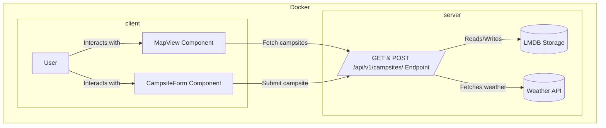

# Campsights

Campsights is a full-stack web app for discovering and sharing campsites. Users can view campsites on a map, see weather forecasts, get directions, add new ones with ratings and details, and see which require 4WD access.

**Live project link:** https://campsights.onrender.com/

## Tech Stack

- **Frontend:** React, Vite, TypeScript, Redux Toolkit, React-Leaflet, Vitest, CSS Modules
- **Backend:** Express, TypeScript, LMDB (for fast key-value storage), National Weather Service API integration
- **Monorepo:** Managed with [Lerna](https://lerna.js.org/)
- **Testing:** Vitest (client & server)
- **Containerization:** Docker, Docker Compose

## Features

- View campsites on an interactive Leaflet map
- See multi-day weather forecasts for each campsite
- Get directions to any campsite via Google Maps
- Add new campsites with name, description, rating, coordinates, and 4WD requirement
- Data is stored in LMDB (server) and served via REST API
- All weather and directions UI is styled via CSS for maintainability
- Comprehensive unit and integration tests using Vitest

## Project Structure



## Monorepo & Lerna

This project uses a **monorepo** structure managed by [Lerna](https://lerna.js.org/).  
Lerna helps manage multiple packages (the frontend and backend) in a single repository. Install all the dependencies for both packages by running `npm i` at root.

**Packages:**
- `packages/client` — The React frontend
- `packages/server` — The Express backend

## Running with Docker

Docker in this app is used to package both the frontend (React) and backend (Express) into a single container.

### Build and start the app

From the project root, run:

```sh
docker-compose up --build
```

- The app will be available at [http://localhost:3000](http://localhost:3000)
- Both the frontend (React) and backend API are served from this address.

### Stopping the app

Press `Ctrl+C` in the terminal running Docker Compose, or run:

```sh
docker-compose down
```

## Local Development (without Docker)

You can still run the client and server separately for development:

```sh
# In one terminal
cd server
npm install
npm run dev

# In another terminal
cd client
npm install
npm run dev
```

- Frontend: [http://localhost:5173](http://localhost:5173)
- Backend API: [http://localhost:3000/api/v1/campsites](http://localhost:3000/api/v1/campsites)

## API

### `GET /api/v1/campsites`
- **Description:** Returns a list of all campsites.
- **Response:**
  - Status: `200 OK`
  - Body: Array of campsite objects
    ```json
    [
      {
        "id": "string",
        "name": "string",
        "description": "string",
        "lat": number,
        "lng": number,
        "rating": number,
        "requires_4wd": boolean,
        "last_updated": "ISO8601 string"
      },
      ...
    ]
    ```

### `POST /api/v1/campsites`
- **Description:** Add a new campsite.
- **Request Body:**
  - JSON object with the following fields:
    ```json
    {
      "id": "string", // required, unique
      "name": "string",
      "description": "string",
      "lat": number,
      "lng": number,
      "rating": number,
      "requires_4wd": boolean,
      "last_updated": "ISO8601 string"
    }
    ```
- **Response:**
  - Status: `201 Created`
  - Body: The created campsite object