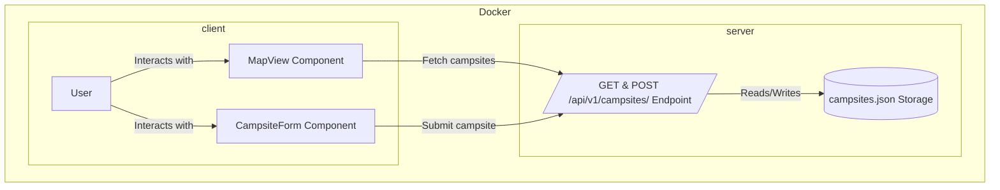

# Campsights

Campsights is a full-stack web app for discovering and sharing campsites. Users can view campsites on a map, add new ones with ratings and details, and see which require 4WD access.

## Features

- View campsites on an interactive map
- Add new campsites with name, description, rating, coordinates, and 4WD requirement
- Data is stored in a JSON file on the backend

## Project Structure



## Getting Started

### 1. Install dependencies

From the root directory:

```sh
cd server
npm install
cd ../client
npm install
```

### 2. Run the app locally

Start the backend:

```sh
cd ../server
npm start
```

Start the frontend:

```sh
cd ../client
npm run dev
```

Frontend: [http://localhost:5173](http://localhost:5173)  
Backend API: [http://localhost:3000/api/v1/campsites](http://localhost:3000/api/v1/campsites)

---

## Running with Docker

You can run both the client and server using Docker Compose.

### 1. Build and start the containers

From the project root:

```sh
docker-compose up --build
```

- The frontend will be available at [http://localhost:5173](http://localhost:5173)
- The backend API will be available at [http://localhost:3000/api/v1/campsites](http://localhost:3000/api/v1/campsites)

### 2. Stopping the containers

Press `Ctrl+C` in the terminal running Docker Compose, or run:

```sh
docker-compose down
```

---

## API

- `GET /api/v1/campsites` — List all campsites
- `POST /api/v1/campsites` — Add a new campsite