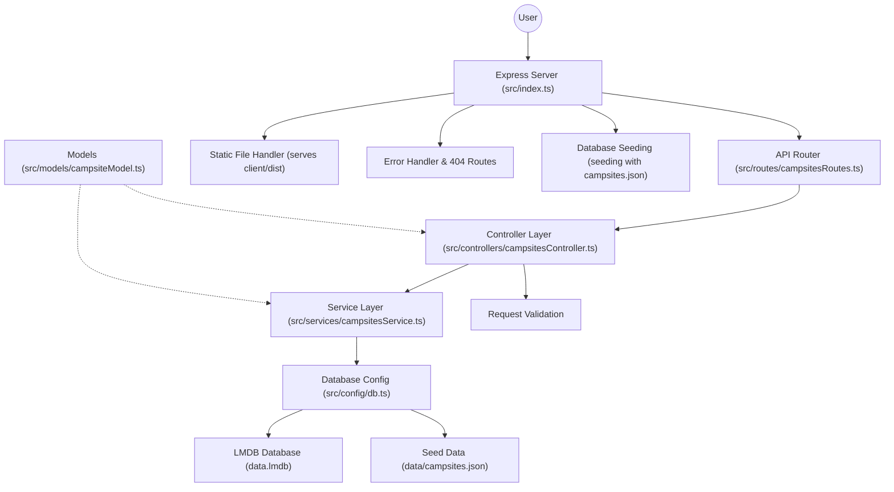

# Campsights Server

This is the backend for the Campsights app, built with Express and TypeScript.  
It provides a REST API for managing campsite data, which is stored in an LMDB database.

## Features

- Serves campsite data to the frontend via REST API
- Accepts new campsite submissions via POST requests
- Stores all data in LMDB (Lightning Memory-Mapped Database)
- CORS enabled for local development
- Automatic database seeding from JSON data
- Full TypeScript support with proper error handling

## Architecture



## Getting Started

1. Install dependencies:
   ```sh
   npm install
   ```

2. Start the development server:
   ```sh
   npm run dev
   ```

3. Or start the production server:
   ```sh
   npm start
   ```

4. The API will be available at [http://localhost:3000/api/v1/campsites](http://localhost:3000/api/v1/campsites)

## API Endpoints

- `GET /api/v1/campsites` — List all campsites
- `POST /api/v1/campsites` — Add a new campsite

### POST Request Format

```json
{
  "id": "unique-string-id",
  "name": "Campsite Name",
  "description": "Description of the campsite",
  "lat": 39.7392,
  "lng": -104.9903,
  "rating": 5,
  "requires_4wd": false,
  "last_updated": "2025-06-19T12:00:00.000Z"
}
```

## Scripts

- `npm run dev` — Start development server with hot reload
- `npm start` — Start server with ts-node
- `npm run build` — Compile TypeScript to JavaScript
- `npm run start:prod` — Start production server (requires build first)
- `npm test` — Run Jest tests

## Database

- **Type**: LMDB (Lightning Memory-Mapped Database)
- **Location**: `data.lmdb/` directory
- **Seeding**: Automatically seeds from `data/campsites.json` on startup
- **Benefits**: High performance, ACID transactions, no separate server process needed
