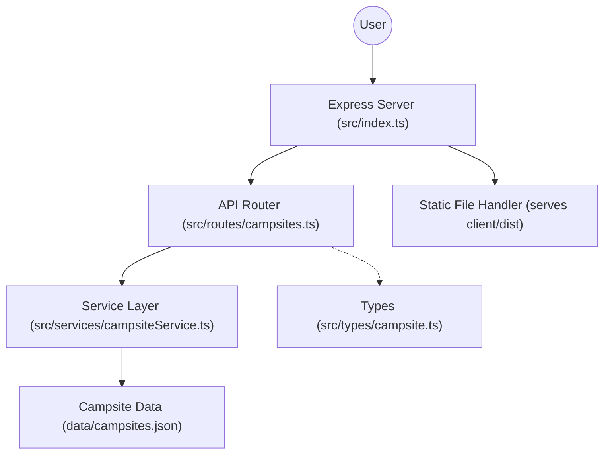

# Campsights Server

This is the backend for the Campsights app, built with Express and TypeScript.  
It provides a REST API for managing campsite data, which is stored in a JSON file.

## Features

- Serves campsite data to the frontend
- Accepts new campsite submissions via POST requests
- Stores all data in `data/campsites.json`
- CORS enabled for local development

## Architecture



## Getting Started

1. Install dependencies:
   ```sh
   npm install
   ```

2. Start the server:
   ```sh
   npm start
   ```

3. The API will be available at [http://localhost:3000/api/v1/campsites](http://localhost:3000/api/v1/campsites)

## API Endpoints

- `GET /api/v1/campsites` — List all campsites
- `POST /api/v1/campsites` — Add a new campsite

## Notes

- The server expects requests from the frontend at `http://localhost:5173`.
- Data is persisted in `data/campsites.json`.